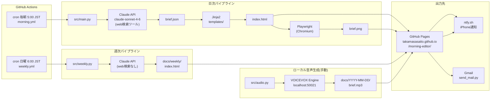

# ARCHITECTURE.md — AI Morning Editor

## 構成図



## 技術スタック

| 層 | 技術 |
|---|---|
| 言語 | Python 3.12 |
| LLM | Anthropic Claude API (`claude-sonnet-4-6`) |
| テンプレート | Jinja2 |
| スクリーンショット | Playwright (Chromium) |
| 音声合成 | VOICEVOX Engine (ローカル) |
| CI/CD | GitHub Actions |
| ホスティング | GitHub Pages |
| 通知 | ntfy.sh / Gmail |

## デプロイ先URL

- **本番**: https://takamasasaito.github.io/morning-editor/
- **週次号**: https://takamasasaito.github.io/morning-editor/weekly/

## 外部依存

| 依存先 | 用途 | 認証 |
|---|---|---|
| Anthropic Claude API | ニュース収集・編集・web検索 | `ANTHROPIC_API_KEY` (Secret) |
| GitHub Pages | 静的HTMLホスティング | リポジトリ設定 |
| ntfy.sh | プッシュ通知 (iPhone) | `NTFY_TOPIC` (Secret) |
| Gmail SMTP | メール配信 | `GMAIL_USER` / `GMAIL_APP_PASS` (Secret) |
| VOICEVOX Engine | 音声合成(ローカル手動のみ) | なし (localhost:50021) |

## データの流れ

```
1. Claude API が web検索で当日ニュースを収集・選定・ファクトチェック
2. JSON形式(brief.json)で構造化 → docs/YYYY-MM-DD/ に保存
3. Jinja2テンプレートでHTMLを生成
4. Playwright が #brief-card をスクリーンショット → brief.png
5. GitHub Actions が docs/ をコミット & push → Pages 自動デプロイ
6. ntfy.sh / Gmail で読者へ通知

週次号: 直近7日分の brief.json を読み込み → Claude でまとめ号編集(web検索なし)
音声版: brief.json のテキストを VOICEVOX で合成 → brief.mp3 (手動)
```
